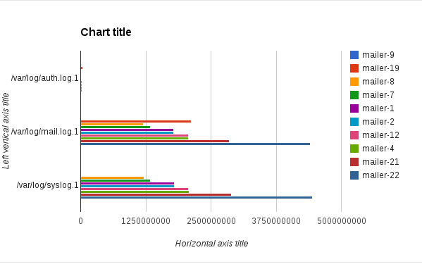
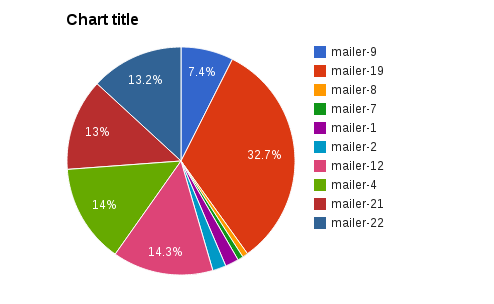

# Easy Visualizations with Google Spreadsheets

On the [8th day of the first
sysadvent](http://sysadvent.blogspot.com/2008/12/day-8-one-off-graphs.html), I
talked about ways to get graphs from arbitrary data. I was never really satisfied
with the result since I find gnuplot to be a bit cumbersome (though it is
powerful).

Since then, technology and tools have improved greatly. For one, Google's got
some pretty neat features in their Google Spreadsheets product.  Bonus, it's
free to use and if your company already uses Google Apps, you've got an easy
way to share data and spreadsheets easily among coworkers. 

So why care? Well, the spreadsheets product has some excellent statistical and
visual tools.

The first time I was exposed to this was when I worked at a web advertising
company. When debugging some odd user tracking data, the workflow usually
included dumping the logs to csv, loading into Excel, doing some magic, and
somehow the problem seemed to identify itself. When watching this process
somewhat reminded me of those ['enhance that photo!' scenes in some crime
dramas](http://www.youtube.com/watch?feature=player_embedded&v=Vxq9yj2pVWk),
but this wasn't fiction, even if sometimes the person driving Excel moved
so quickly my face had this ["are you a
wizard?"](http://static2.fjcdn.com/comments/ARE+YOU+A+WIZARD+_324436c69cd6c0b9ba6bda42bdd0ab01.jpg)
expression on it.

Load the data, do some grouping, sort, filter, summarize, and all pretty
easily. 

Let's figure out how to do that, but first we need a data set to play with.

## Mail server activity

There are a bunch of mail servers at work. Let's look at yesterday's log file
sizes and compare them in a spreadsheet (sounds exciting, I know!)

```
(
  echo "host\tfile\tsize"
  for i in server1 server2 server3 server4 ... ; do 
    ssh $i du -sb /var/log/{mail.log,auth.log,syslog}.1 \
    | awk '{ OFS="\t"; print "'$i'", $2, $1}
  done
) /tmp/maildata.tsv
```

The output is tab-delimited and is hostname, logfile, size-in-bytes. In general,
most spreadsheet tools can import data that is comma or tab-separated quite
easily. My data looks like this:

```
host  file  size
mailer-1  /var/log/mail.log.1 1789031327
mailer-1  /var/log/auth.log.1 2352800
mailer-1  /var/log/syslog.1 1799335420
mailer-12 /var/log/mail.log.1 2066206745
...
```

## Import CSV

Loading this into a spreadsheet is easy. In Google Spreadsheets, `File ->
Import` will let you do it.

Once imported, I get a nice spreadsheet with three columns:


Each line in your file becomes a row in the spreadsheet.

## Pivot Tables

Pivot tables let you group and aggregate data.

Select all the data in your spreadsheet, then create a pivot table with the
`Data -> Pivot table report` menu.

### Which server has the largest total logs?

On the right, you'll see "Report Editor" where you can add rows, columns, and
values to your pivot table. 

To see which server has the largest total logs: 

* click 'Rows - Add field' and choose the 'host'
* click 'Columns - Add field' and choose 'file'
* click 'Values - Add Field' and choose 'size'

At the end of each column and row will be a 'Grand Total' entry which
summarizes the whole column or row.


Since I'm looking for 'largest total logs', for the 'Group by: host' panel on
the right, choose 'Sort by -> SUM of size in...' 'Grand Total' - which results
in this nicely sorted display:


### Which log is largest across all servers?

Create a new pivot table, but this time specify 'file' as the rows, don't add
any columns, and specify 'size' for the values. The result is a table showing
total sum by each log file:


## Visualization

Often, problems aren't easy to solve if your only method is to eye-ball a table
full of numbers. Often the table just looks like noise, so you need a better 
way to represent the data.

The nice property of Google Spreadsheets is that you can build charts from
data easily. Simply select the data in the pivot table (or the spreadsheet) and
choose `Insert -> Chart` from the menu. How about a bar chart with comparing
log sizes across servers?



Or a pie chart?



There are two main points to make here. First, that this tool gives you a wide
array of tools to mold your data into something that answers your questions.
Second, that the minimum number of steps required are usually small. 

Select some data, graph it. Select more data, choose rows/columns/values to
view in aggregate, and maybe make a graph on that. 

It's pretty awesome.

## Leveling Up with Forms

Spreadsheets has this other neat feature called Forms (`New -> Form` from google docs).
A form is basically just a customizable input form that inserts to a
spreadsheet when submitted.

What if you created a form and had a computer write to it, kinda like logging
to your spreadsheet? When creating the form, there is access control that requires
login by default, but you can turn that off - uncheck 'Require <yourdomain>
sign-in to view this form'.

For fun, [Here's a sample form I
made](https://docs.google.com/a/semicomplete.com/spreadsheet/viewform?formkey=dE9EOTROMzBIeG92UDZ2cG9XaHRucFE6MQ#gid=0).
The interesting part here isn't that you can type stuff in as a human, but you
can submit with curl if you wanted to!

How to submit to a Google Form with curl:

* Take the 'formkey' and put it on this url: `https://docs.google.com/spreadsheet/formResponse?formkey=FORMKEY`
* `curl -XPOST https://docs.google.com/spreadsheet/formResponse?formkey=FORMKEY -d "entry.0.single=first&entry.1.single=second&submit=Submit`

The http POST payload is form url-encoded with 'entry.N.single' being each
field value (in your browser, 'inspect element' on the form inputs to see the
names). You must also include 'submit=Submit' set in the POST or google docs
won't record the submission.

Here's a full example using the sample form I made (linked above):

```
echo -n "What is your name? "; read name
echo -n "How are you? "; read status
url="https://docs.google.com/spreadsheet/formResponse?formkey=dE9EOTROMzBIeG92UDZ2cG9XaHRucFE6MQ"
curl -s -XPOST "$url" -d "entry.0.single=${name}&entry.1.single=${status}&submit=Submit"
```

In the output of curl, you should see something like "Your response has been recorded". 

You can view the results of form submissions to this specific form here:
[sysadvent sample form spreadsheet](https://docs.google.com/spreadsheet/ccc?key=0Aq9liCTsAyzRdE9EOTROMzBIeG92UDZ2cG9XaHRucFE#gid=0)

The spreadsheet updates in near-real-time with form postings. Any charts you
are using are also updated when the spreadsheet changes. Smells like this could
be useful for light logging and metric recording, right? I think so!

## Conclusion

Spreadsheets in general are really useful tools because they let you treat
your data like Play-Doh - squish and shape your data into whatever form
is most useful for you!

## Further Reading

* [Pivot Tables in Google Docs](http://www.youtube.com/watch?v=giuD7KSmock) (intro video by Google)
* [Pivot Tables in Google Docs](http://www.youtube.com/watch?v=eUa1LuOjea8) (a real-world tutorial)
* [Charts tutorial in Google Docs](http://www.youtube.com/watch?v=tpChnf-KaIU)
